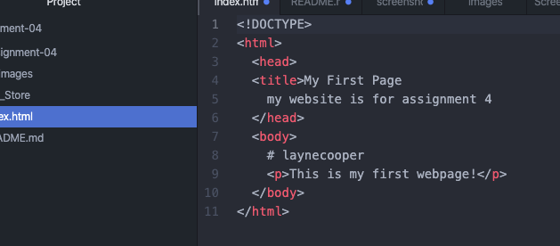

A browser is a program that is used to reach the internet through a device. When you are searching something online, that request you made is sent to the server which contains information about that website (html, css, ect.). Then the browser takes that information from the server and gives you the web page on your device. I use google chrome and safari the most.
Markup language is a language the computer uses to define the elements in a document. Markup language is able to read by humans because in the XML files, they are saved with just standard text, so programs can interpret the language. XML is a common markup used in development.

